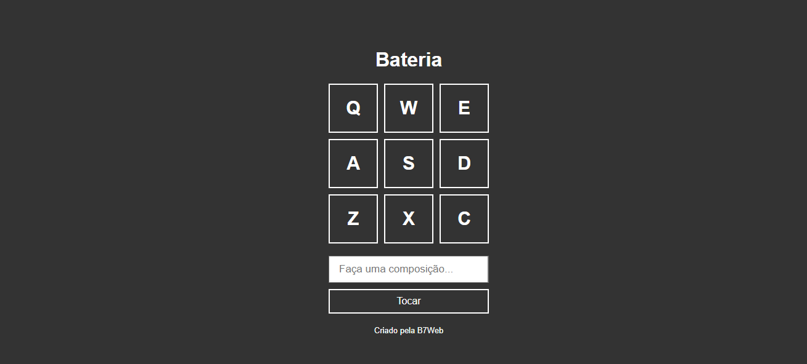

<div align="center" id="top"> 
  

  &#xa0;

  <!-- <a href="https://projeto1.netlify.com">Demo</a> -->
</div>

<h1 align="center">Bateria</h1>

<p align="center">
  

  

  

  

</p>

<!-- Status -->

<!-- <h4 align="center"> 
	🚧  Projeto 1 🚀 Em construção...  🚧
</h4> 

<hr> -->

<p align="center">
  <a href="#dart-sobre">Sobre</a> &#xa0; | &#xa0; 

  <a href="#white_check_mark-pré-requesitos">Pré requisitos</a> &#xa0; | &#xa0;
  <a href="#checkered_flag-começando">Começando</a> &#xa0; | &#xa0;
  <a href="#memo-licença">Licença</a> &#xa0; | &#xa0;
  <a href="https://github.com/Gabriel4420" target="_blank">Autor</a>
</p>

<br>

## :dart: Sobre ##

Bateria de música criada durante a semana javascript da b7web ministrado pelo professor bonieky lacerda.


## :white_check_mark: Pré requisitos ##

Antes de começar :checkered_flag:, você precisa ter o [Git](https://git-scm.com).

## :checkered_flag: Começando ##

```bash
# Clone este repositório
$ git clone https://github.com/Gabriel4420/projeto-1


```

## :memo: Licença ##

Este projeto está sob licença MIT. Veja o arquivo [LICENSE](LICENSE.md) para mais detalhes.


Feito com :heart: por <a href="https://github.com/Gabriel4420" target="_blank">Gabriel Rodrigues Perez</a>

&#xa0;

<a href="#top">Voltar para o topo</a>
